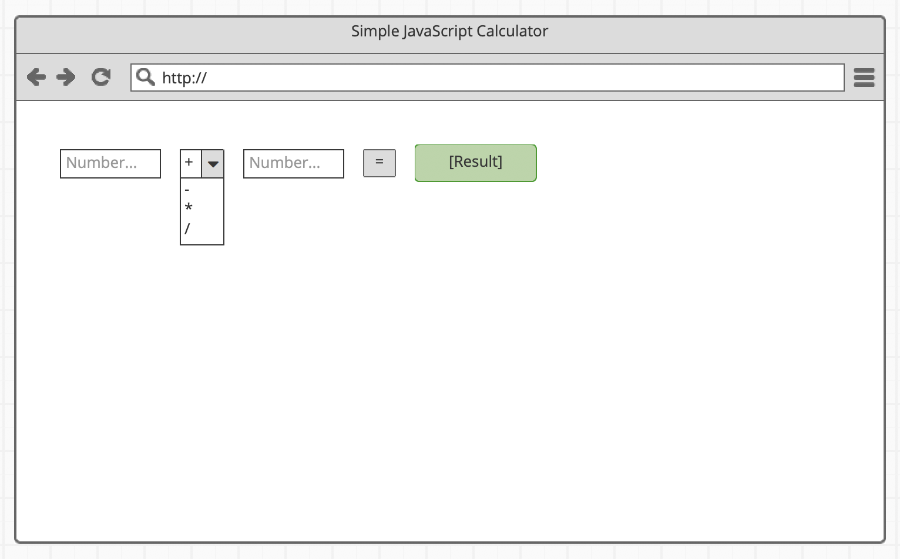

# A simple browser calculator

- Repository name: `simple-calculator`
- Owner: [Muhammad Fawad Rafique](https://github.com/fawadrafique)
- Type of Challenge: `solo learning`
- Tool used: `VS Code`
- Written in : `HTML, CSS and JavaScript`
- GitHub page: [Click here](https://fawadrafique.github.io/simple-calculator/)

Challenge is to build a simple calculator per the given wireframe.

### Specifications

A user can type a number in the first input field, choose one of four operations and input a number in the second input field. Result of the operation is updated in real-time as the user types and displayed in a green box. If a user types invalid characters (e.g. letters instead of numbers), "n/a" is displayed.
